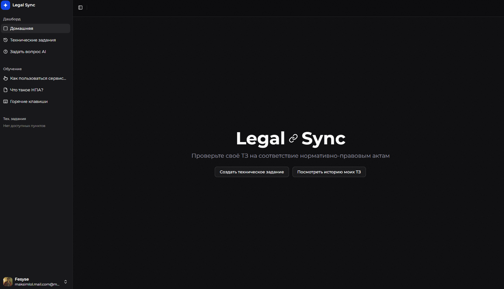

# Legal Sync

Это проект для синхронизации ТЗ и документов в Личном кабинете с официальным правилами и политикой конфиденциальности.



## Запуск проекта

Сначала убедитесь что у вас установлено:

- Node.js
- pnpm

Затем выполните команду:

```bash
pnpm install
```

Скопируйте файл `.env.example` в файл `.env`

```bash
cp .env.example .env
```

Заполните поля в файле `.env`

После этого запустите проект:

```bash
pnpm dev
```

## Лицензия

Этот проект распространяется под лицензией [MIT](https://github.com/fesyse/legal-sync/blob/main/LICENSE).
